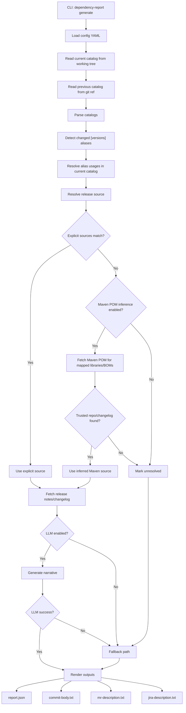

# Dependency Upgrade Report

Dependency Upgrade Report is a small Kotlin library plus CLI for deterministic, CI-friendly upgrade reporting from a Gradle version catalog diff.

It is intentionally scoped to one job:

1. compare the current version catalog against git
2. detect changed `[versions]` aliases
3. map aliases to libraries, BOMs, and Gradle plugins
4. resolve release-note sources from explicit YAML or Maven POM metadata
5. fetch release notes or changelogs
6. generate AI-assisted text, or fall back deterministically
7. write a compact set of output files

It does not mutate repositories, create tickets, browse the web autonomously, or make upgrade decisions.

## MVP scope

The first production-ready iteration keeps only:

- git-backed catalog comparison
- explicit `sources` mappings
- Maven POM metadata inference
- GitHub Releases fetching
- one optional LLM integration path
- deterministic fallback text
- reusable core library plus CLI

It intentionally does not include:

- Gradle Plugin Portal inference
- HTML scraping
- multiple inference modes
- adaptive broad-release selection
- repository-specific orchestration
- extra report artifacts

## Architecture

The repository is organized as:

- `dependency-report-core`: catalog parsing, diffing, source resolution, fetching, LLM integration, fallback behavior, and rendering
- `dependency-report-cli`: git-backed input resolution, YAML loading, CLI entrypoint, and output writing

## Workflow



## Deterministic boundaries

The tool stays deterministic because:

- the baseline comes from an explicit git ref, defaulting to `HEAD`
- the current catalog comes from an explicit file path, defaulting to `gradle/libs.catalog.toml` and then `gradle/libs.versions.toml`
- source resolution order is fixed: `sources` -> `inferredMavenPom` -> `unresolved`
- fetched content is capped before it reaches the LLM
- if fetching or LLM generation fails, the tool emits deterministic fallback text instead of failing the whole workflow

## CLI usage

Default git-backed mode:

```bash
./gradlew :dependency-report-cli:run --args="generate \
  --config /path/to/dependency-report.yaml \
  --output-dir /path/to/output"
```

Optional overrides:

```bash
./gradlew :dependency-report-cli:run --args="generate \
  --config /path/to/dependency-report.yaml \
  --output-dir /path/to/output \
  --catalog-path gradle/libs.catalog.toml \
  --git-ref HEAD"
```

The CLI still accepts explicit snapshot files, but git-backed mode is the intended primary workflow.

## Outputs

The simplified MVP writes only:

- `report.json`
- `commit-body.txt`
- `mr-description.txt`
- `jira-description.txt`

`mr-description.txt` and `jira-description.txt` intentionally use the same rendered text.

## Config

Example:

```yaml
sources:
  - match:
      alias: kotlin
    githubRepo: JetBrains/kotlin
  - match:
      module: org.jetbrains.kotlin:kotlin-bom
    changelogUrl: https://kotlinlang.org/docs/releases.html
  - match:
      alias: google-api-services-gmail
    changelogUrl: https://developers.google.com/workspace/gmail/release-notes
    linkOnly: true

github:
  token: null
  apiBaseUrl: https://api.github.com
  maxReleases: 5
  pageSize: 20
  maxScanReleases: 100
  includePrereleases: false

fetch:
  maxDocumentContentChars: 12000

inference:
  enabled: true
  mavenRepositoryBaseUrl: https://repo1.maven.org/maven2

llm:
  mode: openrouter
  model: openai/gpt-4.1-mini
  apiKey: your-openrouter-api-key
  baseUrl: https://openrouter.ai/api/v1/chat/completions
  retryCount: 3
  retryDelayMs: 750
  requestTimeoutMs: 45000
```

Rules:

- `sources` is the primary deterministic source registry
- `match.alias` matches a changed version alias
- `match.module` matches a resolved Maven coordinate
- `match.pluginId` matches a resolved Gradle plugin id
- `linkOnly: true` keeps the configured release notes URL in the output but skips fetching and LLM enrichment for that entry
- `github.maxReleases` is the number of release notes to keep in the final selection
- `github.pageSize` controls how many GitHub releases are requested per API page
- `github.maxScanReleases` is the hard cap on how many releases may be scanned across all pages
- `github.includePrereleases` controls whether prereleases may fill gaps when there are not enough stable releases
- if no explicit source matches, Maven POM inference is attempted for mapped libraries and BOMs
- Gradle plugins without an explicit source mapping are expected to become unresolved unless they also map through a library or BOM usage

## Logging

The CLI uses Logback plus Kotlin Logging.

Important steps log at `INFO`:

- git-backed input resolution
- catalog parsing and diffing
- source resolution
- release-note fetching
- LLM attempts and retries
- fallback activation
- output writing

Warnings are emitted for unresolved dependencies, fetch failures, and LLM failures.

## Packaging

Build a local distribution with:

```bash
./gradlew :dependency-report-cli:installDist
```

The installed binary is:

- `dependency-report-cli/build/install/dependency-report/bin/dependency-report`

## Future evolution

This MVP is intentionally small. Future enhancements can still be added later, but they should stay outside the default deterministic path unless they are clearly justified.
