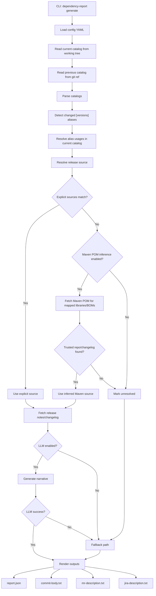

# Dependency Upgrade Report

Dependency Upgrade Report is a small Kotlin library plus CLI for deterministic, CI-friendly upgrade reporting from a Gradle version catalog diff.

It is intentionally scoped to one job:

1. compare the current version catalog against git
2. detect changed `[versions]` aliases
3. map aliases to libraries, BOMs, and Gradle plugins
4. resolve release-note sources from explicit YAML or Maven POM metadata
5. fetch release notes or changelogs
6. generate AI-assisted text, or fall back deterministically
7. write a compact set of output files

It does not mutate repositories, create tickets, browse the web autonomously, or make upgrade decisions.

## Recommended usage

The intended production shape is:

1. publish a versioned CLI release from this repository
2. download that release artifact in a target repository CI job
3. run `dependency-report generate`
4. use the generated files in explicit CI orchestration

In practice:

- `commit-body.txt` is a good fit for the git commit body
- `jira-description.txt` is a good fit for the primary human-readable upgrade report
- `mr-description.txt` can be used directly, or replaced by a short Jira link if your Git provider has trouble with multiline descriptions
- `report.json` is mainly a debugging and provenance artifact

## MVP scope

The first production-ready iteration keeps only:

- git-backed catalog comparison
- explicit `sources` mappings
- Maven POM metadata inference
- GitHub Releases fetching
- one optional LLM integration path
- deterministic fallback text
- reusable core library plus CLI

It intentionally does not include:

- Gradle Plugin Portal inference
- HTML scraping
- multiple inference modes
- adaptive broad-release selection
- repository-specific orchestration
- extra report artifacts

## Architecture

The repository is organized as:

- `dependency-report-core`: catalog parsing, diffing, source resolution, fetching, LLM integration, fallback behavior, and rendering
- `dependency-report-cli`: git-backed input resolution, YAML loading, CLI entrypoint, and output writing

## Workflow



## Deterministic boundaries

The tool stays deterministic because:

- the baseline comes from an explicit git ref, defaulting to `HEAD`
- the current catalog comes from an explicit file path, defaulting to `gradle/libs.catalog.toml` and then `gradle/libs.versions.toml`
- source resolution order is fixed: `sources` -> `inferredMavenPom` -> `unresolved`
- explicit changelog documents may be reduced to relevant version sections before the final content cap is applied
- GitHub release bodies are kept as whole release-note documents and only bounded by the final content cap
- if fetching or LLM generation fails, the tool emits deterministic fallback text instead of failing the whole workflow

## CLI usage

Default git-backed mode:

```bash
./gradlew :dependency-report-cli:run --args="generate \
  --config /path/to/dependency-report.yaml \
  --output-dir /path/to/output"
```

Optional overrides:

```bash
./gradlew :dependency-report-cli:run --args="generate \
  --config /path/to/dependency-report.yaml \
  --output-dir /path/to/output \
  --catalog-path gradle/libs.catalog.toml \
  --git-ref HEAD"
```

The CLI still accepts explicit snapshot files, but git-backed mode is the intended primary workflow.

## Production integration

The tool is designed to be called from CI, not to own CI orchestration itself.

A typical flow in a target repository is:

1. run the catalog update task
2. stop early if the catalog file did not change
3. refresh lock files or other repository-specific artifacts
4. run `dependency-report generate`
5. create Jira / commit / MR in the surrounding script or pipeline

Example CLI invocation:

```bash
dependency-report generate \
  --config dependency-report.yaml \
  --output-dir build/dependency-report \
  --catalog-path gradle/libs.versions.toml
```

Recommended first rollout:

- start with `llm.mode: static`
- add explicit `sources` only for important dependencies first
- treat unresolved dependencies as a supported outcome
- enable `openrouter` only after the deterministic path looks good in a real repository

## Outputs

The simplified MVP writes only:

- `report.json`
- `commit-body.txt`
- `mr-description.txt`
- `jira-description.txt`

`mr-description.txt` and `jira-description.txt` intentionally use the same rendered text.

## Config

Example:

```yaml
sources:
  - match:
      alias: kotlin # Match a changed version alias from [versions].
    githubRepo: JetBrains/kotlin # GitHub repository used for release fetching.
  - match:
      module: org.jetbrains.kotlin:kotlin-bom # Match a resolved Maven module usage.
    changelogUrl: https://kotlinlang.org/docs/releases.html # Explicit changelog URL to fetch.
  - match:
      alias: google-api-services-gmail # Match a changed version alias from [versions].
    changelogUrl: https://developers.google.com/workspace/gmail/release-notes # Reference URL shown in outputs.
    linkOnly: true # Skip fetching/LLM and keep only the link in outputs.

github:
  token: null # Optional GitHub token for higher API rate limits.
  apiBaseUrl: https://api.github.com # GitHub API base URL.
  maxReleases: 5 # Max selected release notes kept for one dependency.
  pageSize: 20 # Releases requested per GitHub API page.
  maxScanReleases: 100 # Hard cap on scanned GitHub releases across pages.
  includePrereleases: false # Allow RC/beta releases to fill missing release slots.

fetch:
  maxDocumentContentChars: 12000 # Max stored characters per fetched document.

inference:
  enabled: true # Enable Maven POM-based source inference.
  mavenRepositoryBaseUrl: https://repo1.maven.org/maven2 # Maven repository used for POM lookup.

llm:
  mode: static # Use 'static' for deterministic summaries or 'openrouter' for LLM enrichment.
  model: openai/gpt-4.1-mini # Model name for OpenRouter mode.
  # Optional local override. Prefer apiKeyEnv in CI.
  # apiKey: your-openrouter-api-key
  apiKeyEnv: OPENROUTER_API_KEY # Environment variable name holding the OpenRouter API key.
  baseUrl: https://openrouter.ai/api/v1/chat/completions # OpenRouter chat completions endpoint.
  retryCount: 3 # Retry count for transient OpenRouter failures.
  retryDelayMs: 750 # Delay between OpenRouter retries in milliseconds.
  requestTimeoutMs: 45000 # Timeout per OpenRouter request in milliseconds.
```

Rules:

- `sources` is the primary deterministic source registry
- `match.alias` matches a changed version alias
- `match.module` matches a resolved Maven coordinate
- `match.pluginId` matches a resolved Gradle plugin id
- `linkOnly: true` keeps the configured release notes URL in the output but skips fetching and LLM enrichment for that entry
- `llm.apiKeyEnv` is the preferred CI-friendly way to provide the OpenRouter API key from an environment variable
- `llm.mode: static` produces deterministic summaries without LLM output
- `llm.mode: openrouter` enables LLM enrichment and falls back to deterministic summaries on failure
- `github.maxReleases` is the number of release notes to keep in the final selection
- `github.pageSize` controls how many GitHub releases are requested per API page
- `github.maxScanReleases` is the hard cap on how many releases may be scanned across all pages
- `github.includePrereleases` controls whether prereleases may fill gaps when there are not enough stable releases
- `fetch.maxDocumentContentChars` limits stored document size to keep reports and prompts bounded
- oversized explicit changelog documents may be reduced to matching version sections before the final size cap is applied
- oversized GitHub release bodies are not section-selected; they are kept whole and then capped if needed
- `inference.enabled` toggles Maven POM-based source inference when no explicit source matches
- if no explicit source matches, Maven POM inference is attempted for mapped libraries and BOMs
- Gradle plugins without an explicit source mapping are expected to become unresolved unless they also map through a library or BOM usage

Validation notes:

- `github.maxReleases`, `github.pageSize`, and `github.maxScanReleases` must be greater than zero
- `llm.mode: openrouter` requires a non-blank `model`
- `llm.mode: openrouter` requires either `apiKey` or `apiKeyEnv`
- if `apiKeyEnv` is used, the environment variable must still exist at runtime

Practical presets:

Balanced configuration:

```yaml
github:
  token: null
  maxReleases: 3
  pageSize: 10
  maxScanReleases: 30
  includePrereleases: false

llm:
  mode: static
```

Lower API usage:

```yaml
github:
  token: null
  maxReleases: 2
  pageSize: 10
  maxScanReleases: 20
  includePrereleases: false

llm:
  mode: static
```

## Logging

The CLI uses Logback plus Kotlin Logging.

Important steps log at `INFO`:

- git-backed input resolution
- catalog parsing and diffing
- source resolution
- release-note fetching
- LLM attempts and retries
- fallback activation
- output writing

Warnings are emitted for unresolved dependencies, fetch failures, and LLM failures.

## Packaging

Build a local distribution with:

```bash
./gradlew :dependency-report-cli:installDist
```

The installed binary is:

- `dependency-report-cli/build/install/dependency-report/bin/dependency-report`

## Releases

This repository includes an end-to-end release helper:

```bash
scripts/publish_release_artifacts.sh 0.1.0
```

It will:

1. build `installDist`
2. package the CLI into a zip
3. generate a SHA-256 checksum file
4. create the local git tag if needed
5. push the tag
6. create the GitHub Release if needed
7. upload or replace the release assets

Expected published assets:

- `dependency-report-<version>.zip`
- `dependency-report-<version>.zip.sha256`

These assets are the intended download unit for other repositories.

## Future evolution

This MVP is intentionally small. Future enhancements can still be added later, but they should stay outside the default deterministic path unless they are clearly justified.
